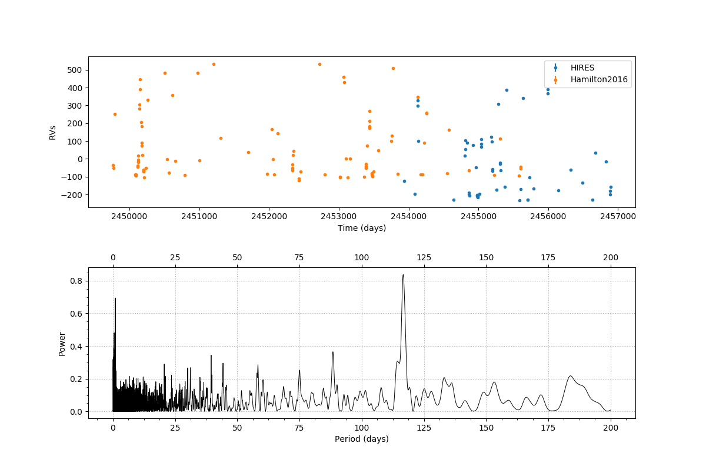

# Multiple-instrument-periodogram
Periodogram generator for a multiple-instrument radial velocities data set, considering the different offset of each instrument.

This code generates a periodogram using data obtained by different instruments with its different offsets, with the option
to save the image and the power values.
The user only needs to insert a list with the name of the instruments used, the name of the file containing the data 
and frequency range to evaluate the data. 

  

## Input data format
A file consisting of the following columns: time, data, data error, intrument name.
Example files are attached to the project.

Author: Giulia Martos (giulia_martos@usp.br)
